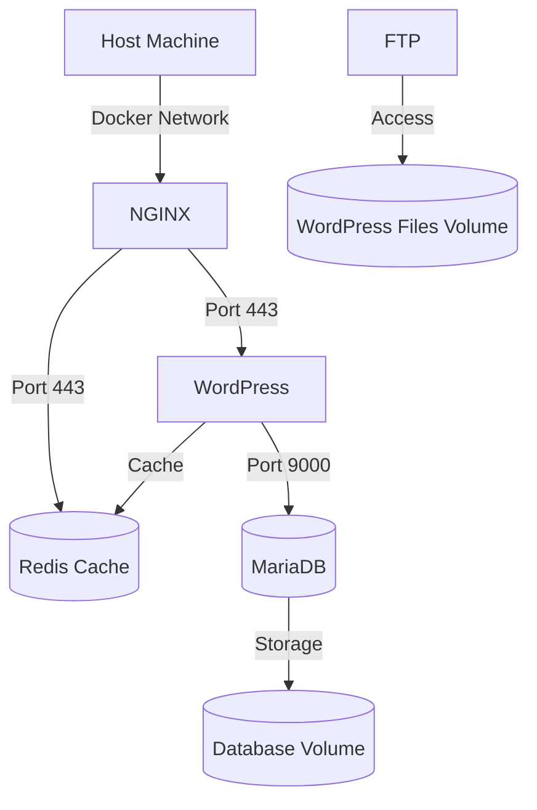

# Inception Project - System Administration with Docker

## Overview

This project is a system administration exercise focused on Docker technology. The goal was to virtualize several Docker images in a personal virtual machine, creating a small infrastructure with different services following specific rules.

## Project Requirements

### Mandatory Part
- Set up a Docker infrastructure with the following components:
  - NGINX container with TLSv1.2 or TLSv1.3
  - WordPress container with php-fpm (without nginx)
  - MariaDB container (without nginx)
  - Two volumes:
    - One for WordPress database
    - One for WordPress website files
  - A docker-network connecting all containers

### Bonus Part (Completed)
- Redis cache for WordPress
- FTP server pointing to WordPress volume

## Technical Specifications

- All containers must restart automatically in case of crash
- Used Docker Compose for orchestration
- Each service runs in its own container
- Built from Alpine or Debian (penultimate stable version)
- Custom Dockerfiles for each service
- Environment variables used for configuration (no hardcoded passwords)
- Domain name configuration: `login.42.fr` pointing to local IP

## Directory Structure

```
.
├── Makefile
├── secrets/
│   ├── credentials.txt
│   ├── db_password.txt
│   ├── db_root_password.txt
├── srcs/
│   ├── docker-compose.yml
│   ├── .env
│   ├── requirements/
│   │   ├── mariadb/
│   │   ├── nginx/
│   │   ├── wordpress/
│   │   ├── redis/       [bonus]
│   │   └── ftp/        [bonus]
```

## Infrastructure Diagram



## How to Use

1. Clone the repository
2. Configure your `.env` file with appropriate variables
3. Run `make` to build and start the containers
4. Access WordPress at `https://yourlogin.42.fr`

## Security Notes

- All credentials are stored in environment variables or Docker secrets
- No passwords are hardcoded in Dockerfiles
- NGINX is the sole entry point (port 443 only)
- Followed Docker security best practices

## Bonus Features

- **Redis**: Implemented as a cache for WordPress to improve performance
- **FTP Server**: Allows direct file access to WordPress volume for management

This project demonstrates comprehensive system administration skills with Docker, including containerization, networking, security, and performance optimization.
